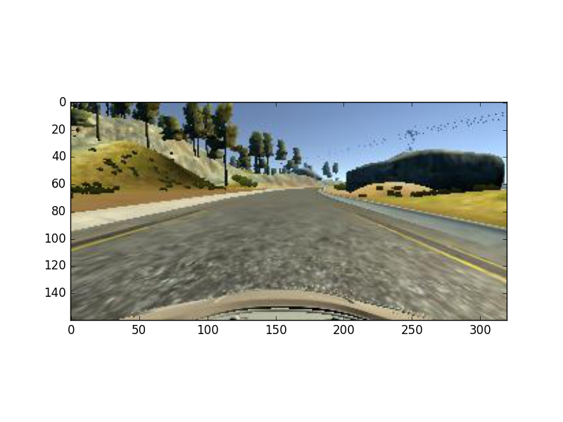
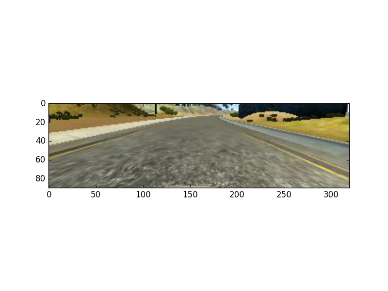
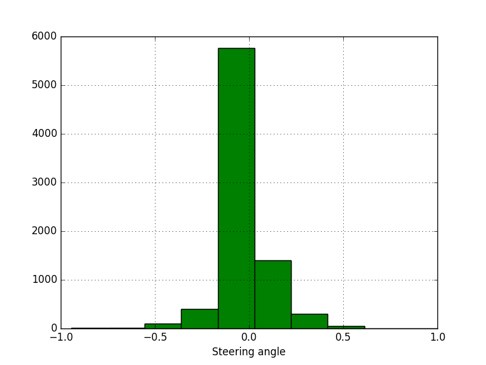
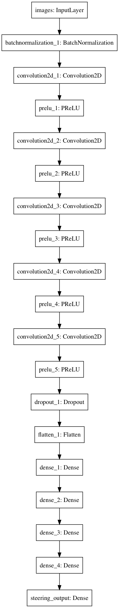
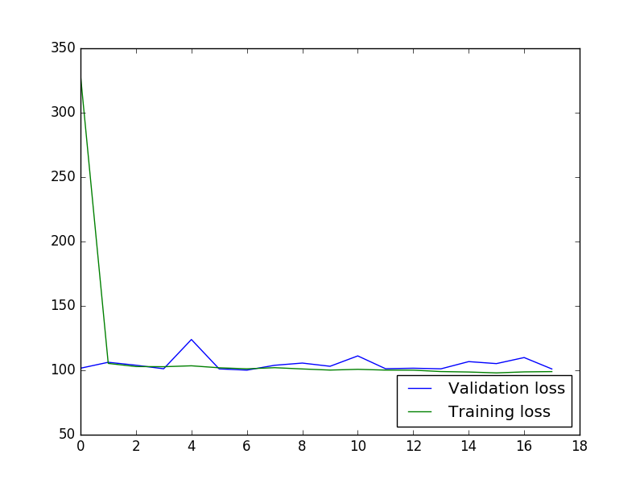
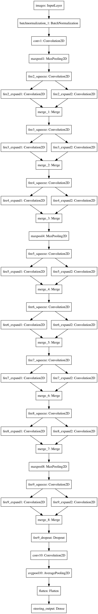
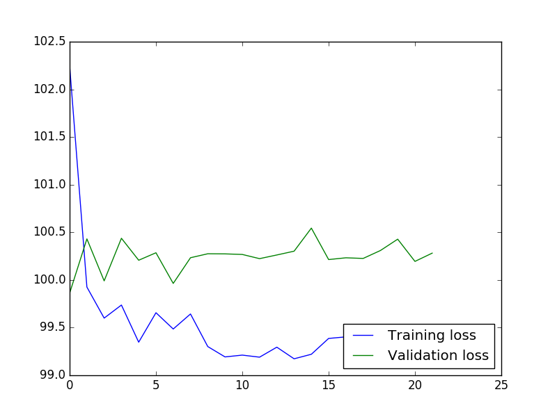

# Car Behaviour Cloning
Behavior cloning of driving a car on a track. The purpose of the program is to
train a neural network to mimic driving behaviour of a human. The driving data
is collected from a simulation.

To correctly mimic human behaviour in a car driving simulator We undertook the following steps:
 1. Build a convolutional neural network using Keras in Python to predict steering angles.
 2. Train and validate the model.
 3. Test and learn the architecture.
 4. Generate more data using the simulator.

Below We will discuss each of the steps We undertook.

# Build a Convolutional Neural Network in Keras
We used two convolutional neural networks architectures to predict the steering
angle. The first is based on the [NVidia architecture](http://images.nvidia.com/content/tegra/automotive/images/2016/solutions/pdf/end-to-end-dl-using-px.pdf).
The second one is based on [Squeezenet](https://arxiv.org/abs/1602.07360). The
benefit of the latter is that it allows to have accuracy as high as
[AlexNet](http://vision.stanford.edu/teaching/cs231b_spring1415/slides/alexnet_tugce_kyunghee.pdf)
but with fifty times less parameters. We will discuss the steps that we
undertook to build, calibrate and test the model below. First we will explain
how we loaded the data.

## Model input
The model input consists of images that are recorded in a car simulator. There
are recordings from the left, center and right cameras. Moreover, the behaviour
of the driver is recorded in a log file. In the log file the steering angle is
recorded as well as the throttle and the break. We initially developed
adaptations of the NVidia model where we had multiple inputs and multiple
outputs. We found that using this model to drive the car lead to poor results.
The car would immediately drive off the road. Instead we opted to use a constant
throttle and break and to only use the model to predict the steering angle.

In the first model we used the left, center and right camera as separate inputs
to the model. We found however, that the simulation feeds only a center image
when driving. As a result we could not use this model. We therefore decided to
load all the images in a single array with according steering angles.

### Cropping
To reduce the dimensionality of the calibration we decided to crop the image.
Our initial images looked as follows,

which was 320 by 160 pixels. We decided to crop the bottom and the top since
this does not hold any valuable information for driving. Our final image looks
as follows,

this image is 320 by 90 pixels.

### Data augmentation
To augment the dataset we mirror all the images from the left, center and right
camera and flip them. As training labels for these images we use the negative
steering angle.

### Data elimination
When loading the data we found that many steering angles are around zero. A
histogram of the steering angles looks as follows,

we added a parameter to the model calibration that allows to remove absolute
steering angles that are lower than a certain threshold.

### Normalization
We apply batch normalization on the images using Keras builtin functionalities.

### Hold out
We shuffle the data and hold out 25 percent for validation purposes.

# Model design
We tried to different models. The first is NVidia's model. The benefit of this
model is that it is used successfully in behaviour cloning for car steering.
Moreover, the model is not very deep allow for fast calibration. We will discuss
the details of this model next.

## NVidia model
The NVidia model consists of the following architecture,

Totalling 20,375,820 trainable parameters. We use the mean absolute percentage
error as a cost function and [Adamax](https://arxiv.org/pdf/1412.6980.pdf) for
stochastic optimization. We use a batch size of 100. The model performance in
terms of mean absolute percentage error is show below.

We see that the validation model performance hovers around 100% and its stopped
early because the validation performance is not improving. The disadvantage of
the NVidia model is that the weights file are large, around 80 megabytes. This
can be an issue if we want to deploy the model to an embedded system such as a
car navigation system. For that reason we research the squeeze net architecture.
The advantage of the squeeze net model is that it has much less weights than the
NVidia model.

## Squeezenet model
The second model that we built is based on the squeezenet architecture. The
squeezenet architecture is derived from Alexnet, a neural network that won a
prize in 2012, but with about 50 times less variables. The architecture of the
network is as follows,

Totalling 2,178,643 trainable parameters, which is a factor 10 times smaller
than our previous architecture. It achieves this by sampling very often. As for
the NVidia architecture we use the mean absolute percentage error (MAPE) as a
cost function and Adamax for stochastic optimization. The model performance in
terms of MAPE is,

We see that despite the dropout layers in the squeeze net the model is not good
at generalizing the findings it learns on the training set.

# Running the program

## Install requirements
You can install the requirements using `pip3 install -r requirements.txt`.

## Train the model
You can download sample data using `./download_sample_data.sh`. Once the data is downloaded the neural net can be trained using
`python3 model.py --model . --data data/ --epochs 10 --arch nvidia`.

After completing the epochs you can use the model as follows, `python3 drive.py model.json`. You can run the simulator.

### Files
* `model.py` allows to train the weights of a neural network.
* `drive.py` allows to use the trained model to drive a car using the UDacity simulator.
* `model.h5` the weights of a model.
* `model.json` the json representation of the neural network.
* `requirements.txt` you can use this file to install all the python3 required files.
