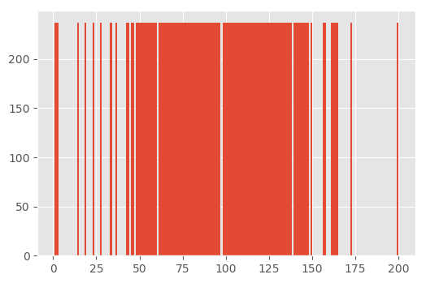

# Car Behaviour Cloning
Behavior cloning of driving a car on a track. The purpose of the program is to
train a neural network to mimic driving behaviour of a human. The driving data
is collected from a simulation.

To correctly mimic human behaviour in a car driving simulator We undertook the following steps:
 1. Build a convolutional neural network using Keras in Python to predict steering angles.
 2. Train and validate the model.
 3. Test and learn the architecture.
 4. Generate more data using the simulator.

Below We will discuss each of the steps We undertook.

# Build a Convolutional Neural Network in Keras
We use a convolutional neural network with a wide residual block to predict the
steering angle. We started with the [NVidia architecture](http://images.nvidia.com/content/tegra/automotive/images/2016/solutions/pdf/end-to-end-dl-using-px.pdf).
Where our implementation is different from NVidia's is that we add a wide
residual block within the last part of the convolutional layers following
[Zagoruyko, 20016](https://arxiv.org/abs/1605.07146) as well as batch normalization
and dropout. To reduce the size of the neural network we added an average pooling
layer. The final architecture looks as follows,


The summary per layer is as follows,

```
_________________________________________________________________
Layer (type)                 Output Shape              Param #
=================================================================
images (InputLayer)          (None, 120, 120, 3)       0
_________________________________________________________________
lambda_1 (Lambda)            (None, 120, 120, 3)       0
_________________________________________________________________
conv2d_1 (Conv2D)            (None, 60, 60, 24)        1824
_________________________________________________________________
spatial_dropout2d_1 (Spatial (None, 60, 60, 24)        0
_________________________________________________________________
conv2d_2 (Conv2D)            (None, 30, 30, 36)        21636
_________________________________________________________________
spatial_dropout2d_2 (Spatial (None, 30, 30, 36)        0
_________________________________________________________________
conv2d_3 (Conv2D)            (None, 15, 15, 48)        43248
_________________________________________________________________
spatial_dropout2d_3 (Spatial (None, 15, 15, 48)        0
_________________________________________________________________
conv2d_4 (Conv2D)            (None, 15, 15, 64)        76864
_________________________________________________________________
spatial_dropout2d_4 (Spatial (None, 15, 15, 64)        0
_________________________________________________________________
conv2d_5 (Conv2D)            (None, 15, 15, 64)        102464
_________________________________________________________________
spatial_dropout2d_5 (Spatial (None, 15, 15, 64)        0
_________________________________________________________________
flatten_1 (Flatten)          (None, 14400)             0
_________________________________________________________________
dropout_1 (Dropout)          (None, 14400)             0
_________________________________________________________________
dense_1 (Dense)              (None, 100)               1440100
_________________________________________________________________
dense_2 (Dense)              (None, 50)                5050
_________________________________________________________________
dense_3 (Dense)              (None, 10)                510
_________________________________________________________________
dropout_2 (Dropout)          (None, 10)                0
_________________________________________________________________
steering_output (Dense)      (None, 1)                 11
=================================================================
Total params: 1,691,707.0
Trainable params: 1,691,707.0
Non-trainable params: 0.0
_________________________________________________________________
```

To prevent overfitting we add max normalization constraint to each layer.
Throughout the network we use
[ELU activations](https://arxiv.org/pdf/1511.07289.pdf). The advantage of ELU
activation is that they converge faster and lead to higher accuracy and don't
have problems with vanishing gradient. The final mapping to the steering angle
uses a Tanh activation.

We initialize the weights with a Glorot normal distribution
[Glorot, X. and Bengo, Y. 2010](http://proceedings.mlr.press/v9/glorot10a/glorot10a.pdf).

We optimize the model with the Adam with Nesterov Momentum (NADAM) optimizer
and a mean square error (MSE) measurement. The weights are saved every time
that the model finds a new lowest MSE on the validation set. Since we want to
keep a large amount of data for training we hold out ten percent of the data
for validation.


## Model input
The model input consists of images that are recorded in a car simulator. There
are recordings from the left, center and right cameras. Moreover, the behaviour
of the driver is recorded in a log file. In the log file the steering angle is
recorded as well as the throttle and the break. We initially developed
adaptations of the NVidia model where we had multiple inputs and multiple
outputs. We found that using this model to drive the car lead to poor results.
The car would immediately drive off the road. Instead we opted to use a constant
throttle and break and to only use the model to predict the steering angle.

In the first model we used the left, center and right camera as separate inputs
to the model. We found however, that the simulation feeds only a center image
when driving. As a result we could not use this model. We therefore decided to
load all the images in a single array with according steering angles.

### Cropping
To reduce the dimensionality of the calibration we decided to crop the image.
Our initial images looked as follows,


which was 320 by 160 pixels. We decided to crop the bottom and the top since
this does not hold any valuable information for driving. Our final image looks
as follows,


this image is 320 by 90 pixels. To reduce the size of the network we rescale
the image to 120 by 120.

### Data augmentation
We first balance the data set after which we proceed with transformation of the
images. Before performing these steps we shuffle and split a training and test
set. The validation set is not modified.

#### Balancing
We perform several data augmentation steps. First we note that driving data is
likely not to be balanced. If we look at the initial data set we see the following
distribution of the steering angle over time,


or in a histogram,


the mode of the data is a clear outlier and other classes are much less represented.
This will cause the neural network to have very little information when to take a stronger
angle. To solve this we balance the data set.

To balance the data set we first bins of the original steering angle. After that we
digitize the steering angle in the bins. We remove the mode of the data since that will
likely by straight driving.

With the straight driving removed, we proceed by running the Random Over Sampler
to equalize the distribution of steering angles. This is implemented in the
`balance_data_set()` function. The final histogram now looks like,



Since we have only limited images with extreme steering angles we have to repeat images.
This could lead to poor generalization of learning. Hence we perform image transformations next.

#### Image transformation
To perform image transformation we use Keras' `ImageGenerator()` function. This function allows us
to perform rotation, vertical and horizontal shift, shearing, zooming and channel shift. The
resulting images look as follows,


transforming the images will lead to a better fit of the final model.

### Training data generation
To generate the training data we drove four lapses where two were close to the
left yellow line and two close to the right yellow line with recovery. In
addition we drove drove three lapses with center line.

# Running the program

## Install requirements
You can install the requirements using `pip3 install -r requirements.txt`.

## Train the model
You can download sample data using `./download_sample_data.sh`. Once the data is downloaded the neural net can be trained using
`python3 model.py --model . --data data/ --epochs 10 `.

After completing the epochs you can use the model as follows, `python3 drive.py model.json`. You can run the simulator.

### Files
* `model.py` allows to train the weights of a neural network.
* `drive.py` allows to use the trained model to drive a car using the UDacity simulator.
* `model.h5` the weights of a model.
* `model.json` the json representation of the neural network.
* `requirements.txt` you can use this file to install all the python3 required files.
